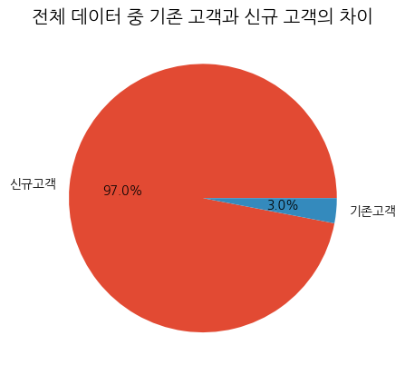
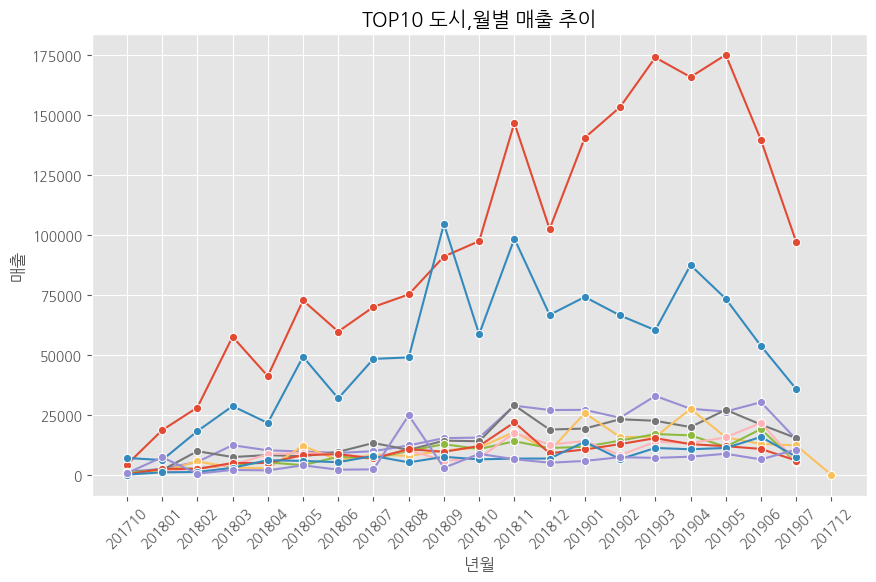
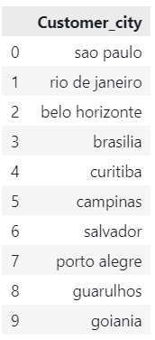
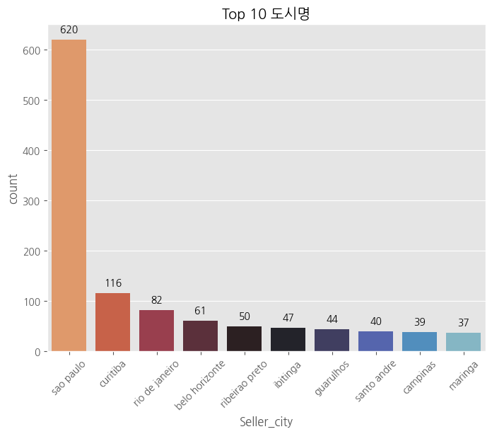
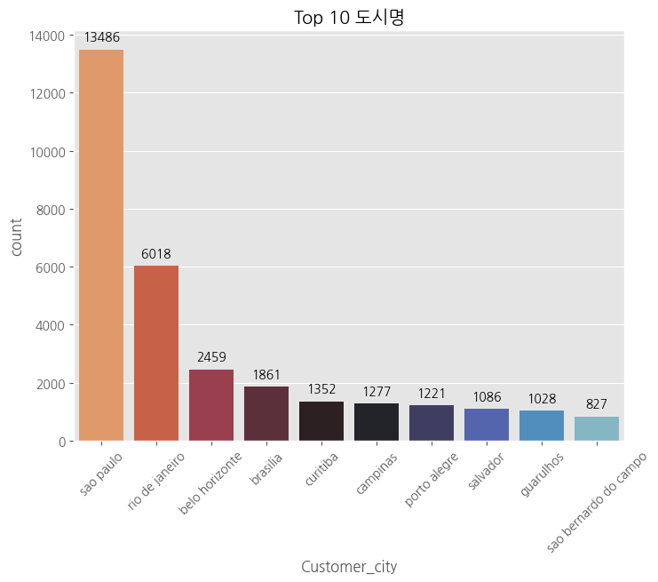
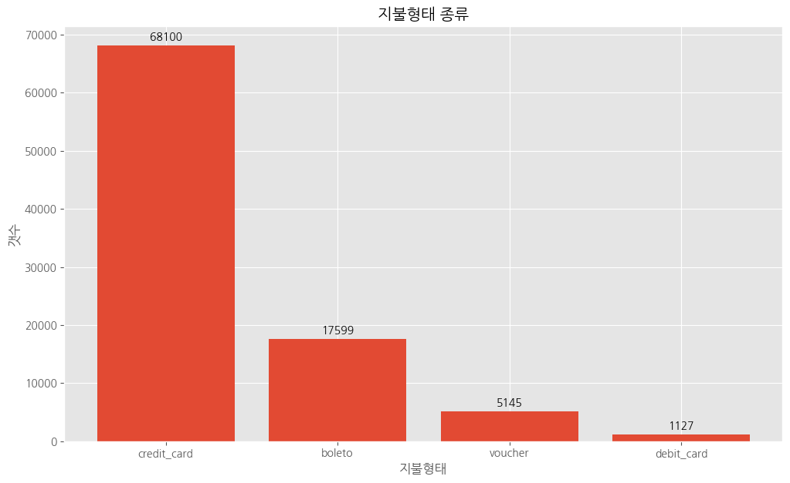

# KPI 도출 비즈니스 전략

## 전략 목표 설정
> 대회 평가 기준

- 실제 비즈니스 환경에서 발생하는 복잡한 데이터 분석  
- 기업의 성장과 고객 만족을 도모할 수 있는 전략을 개발

---
> 월별 매출 추이와 MAU의 상관관계
<table>
    <tr>
        <td></td>
        <td></td></td>
    </tr>
</table>

위의 그림은 월별로 **매출 추이**와 **활동 유저**를 시각화한 그림입니다.
**저는 기업의 성장이라는 정성적인 목표에 대해서 '(1)매출액', '(2)거래빈도',(3)활동 유저(MAU)'의 증가라는 정량적인 목표로 이 문제를 정의 하고자 합니다.**

>   전략 목표 설정 

기업이 성장하기 위해서 세 가지로 정량적인 수치가 있습니다.

    1. 매출액
    2. 거래량
    3. 활동 유저

또한 이 세가지 정량적인 수치에 대해서 볼 수 있는 관점을 세 가지로 뽑았습니다.

    1. 구매자 관점
    2. 제품 관점
    3. 도시 관점

전체 매출액, 전체 거래 빈도, 전체 활동 유저에 대해서, 각각의 관점에 대해서 분석해 보았습니다.
<table>
    <tr>
        <td></td>
        <td></td></td>
        <td></td></td>
    </tr>
</table>

첫번째그림은 전체 매출액에 대해서 각 고객, 제품, 구매자의 도시에 따른 매출액을 오름차순으로 정렬하여 누적 수치를 가시화하였습니다.  
두번째 그림과, 세번째 그림 역시, 각 카테고리군에 따라서, 거래량과 유저 수 누적 수치를 가시화하였습니다. 

가장 눈에 띄게 보이는 것은 두 번째 그림과 세 번째 그림의 그래프가 동일하다는 것입니다. 
이것은 거래빈도와 유저 수가 동일한 범주로 보아야 한다로 해석하게 됬습니다.  

그 이유로 유저 수에 대한 분석을 진행하였는데, 유저 수를 증가시키기 위해서는 두 가지 분류로 나뉩니다.
    
    1)신규유저 증가
    2)기존유저 유지

신규 유저 수가 증가하는 것은 거래 수가 증가하는 것과 같은 의미입니다. 기존 유저가 아닌 새로운 유저가 증가하는 것은 거래가 증가하는 것과 같다는 것입니다.   그러면 2번이상 거래하는 유저를 기존 유저라고 할 때 그들의 비율이 높지 않기 때문에, 거래량과 유저 수를 동일한 범주로 놓아도 된다고 생각했습니다.

재구매가 이루어진 구매자를 **기존 고객**, 재구매가 이루어지지 않은 구매자를 **신규 고객**을 설정하고 가시화했습니다.

>   신규/기존 고객 분석

<div style='text-align:center'>
<table>
    <tr>
        <td></td>
        <td></td></td>
    </tr>
</table>
</div>

예상대로 신규고객이 기존고객보다 상당히 많음을 볼 수 있습니다.  
전체 거래 내역을 통해서 2번 이상 구매가 이루어진 구매자를 기존 고객으로, 1번만 구매한 구매자를 신규 고객으로 분류하였을 때, 97%가 신규 구매자이고, 3%가 기존 구매자입니다.  
또한,거래량 데이터에서 볼 때, 거래량 데이터가 신규 거래에 비해 기존 거래가 6.1%에 불가하다는 수치는 3%의 기존 구매자가 한번 정도 더 거래했다는 수치였기에, 현재 데이터 상으로, 유저 수 증가와 거래량에 대해서, 동일선상에 두어도 된다라고 해석했습니다.

그렇지만, 신규유저가 많다는 것은  신규유저가 기존유저로 유입된다면 많은 활동 유저 수의 증가를 예상할 수 있다는 것을 말합니다.  
이점을 고려할 때, 신규유저를 기존유저로 만드는 전략의 방향성에 대해서 마지막으로 검증해야 했습니다.


전체 거래액과 재구매하는 거래액의 연관성을 보기 위해서 0과 1사이의 값으로 스케일을 조정하여 정규화한 그래프입니다.  
이 그래프를 통해서 둘 사이가 상당히 많이 연관되어 있음을 알 수있습다. 이것을 앞서서 본 결과와 같이 해석하면
**기존 구매율을 늘리는 것의 영향도가 전체 거래액에 영향을 끼치지 않기에 전체 구매액과 거래액이 증가할 때, 자연스럽게 재구매하는 사람들이 늘어난다고 이 그래프를 해석할 수 있습니다.**

따라서 신규 유저를 기존 유저로 바꾸는 방향이 아닌, 유저 수를 제외 한 전체적인 매출액과 거래량을 종속변수로 두고 회귀 분석하는 접근하는 방향으로 설정하였습니다. 

고객, 제품, 도시 관점에서 매출액과 거래량에 대한 이상치를 탐색했습니다.


<table>
    <tr>
        <td></td>
        <td></td></td>
    </tr>
</table>

**매출액에 대해서 데이터의 상위 20%의 고객, 제품, 도시 들이, 거래량에 대해서는 데이터의 상위 20%의 제품, 도시들이**    
**다른 값들과의 두드러진 증가인 이상치가 있음을 알 수 있었습니다.**

그래프에 표시된 값들 해당 지점 이후의 값들이 가지는 전체 매출액 및 거래량에 대한 퍼센테이지입니다.  
방금 언급한 각 이상치에 대해서 50%이상의 값의 범위를 차지하고 있음을 볼 수 있습니다.

그래서 이 이상치가 유의미한 값을 가지고 있다고 생각하고 분석하려고 합니다.

>   고객 관점

**고객 관점에서 제가 설정한 독립변수는 다음과 같습니다.**

<table>
<tr><td>분류</td><td>컬럼이름</td><td>설명</td></tr>
<tr><td>평균 배송비</td><td>ship_fee</td><td>고객이 주문한 거래의 평균 배송비</td></tr>
<tr><td>평균 배송일</td><td>ship_diff</td><td>고객이 주문한 거래의 평균 배송일</td></tr>
<tr><td>배송 적중률</td><td>ship_heat</td><td>고객이 주문한 예상 배송일이 실제 배송일보다 빨리 도착하거나 제 날에 도착할 확률</td></tr>
</table>

**고객 관점에서 제가 설정한 종속변수는 다음과 같습니다.**
<table>
<tr><td>누적 거래액</td><td>분류</td><td>분류</td></tr>
</table>

<div style="text-align:center">

</div>

이렇게 정의된 변수에 대해서, 상관계수를 구해본 결과 
고객 관점에서 유의미한 상관관계 값을 가진다고 나타난 것은,  
누적 거래액 - 배송비 - 배송일 - 배송적중률 이었습니다. 

**배송적중률(ship_heat) -> 배송일(ship_diff): -0.62**
- 배송 적중률은 실제로 배송되는 기간이 길어질 수록 감소합니다.

**배송일(ship_diff) -> 배송비(ship_fee) : +0.22**
- 배송일이 길어질수록 배송비가 증가합니다.

**배송비(ship_fee)) -> 누적 거래액(Revenue) : +0.45**
- 배송비가 많아질 수록  누적거래액이 증가합니다.

하나의 고객이 한 개의 거래내역밖에 가지지 못하므로, 데이터가 부족하여서, 배송비가 누적 거래액과 비례관계를 가진다고 나타났습니다. 
이는 데이터 부족으로 잘못된 인사이트를 주었습니다.

>   제품 관점

**제품 관점에서 제가 설정한 독립변수는 다음과 같습니다.**

<table>
<tr><td>분류</td><td>컬럼이름</td><td>설명</td></tr>
<tr><td>제품 무게</td><td>Product_weight_g</td><td>제품의 무게</td></tr>
<tr><td>제품 부피</td><td>volume_cm3</td><td>제품 부피</td></tr>
<tr><td>제품의 판매 가격</td><td>Price</td><td>제품 가격</td></tr>
<tr><td>제품 배송비</td><td>Freight_value</td><td>배송비</td></tr>
<tr><td>제품이 포함된 거래의 평균 액수</td><td>mean_order_price</td><td>제품이 포함된 거래의 평균 액수</td></tr>
</table>

**제품 관점에서 제가 설정한 종속변수는 다음과 같습니다.**
<table>
<tr><td>누적 제품 판매액</td><td>Revenue</td><td>누적 판매량</td></tr>
<tr><td>누적 제품 거래량</td><td>count</td><td>누적 거래량</td></tr>
</table>


<div style="text-align:center">

</div>


>   도시 관점

도시를 기준으로 누적 거래액과 거래량을 보았을 때, 큰 폭의 증가가 있는 것을 확인할 수 있었습니다.

<table style='text-align:center'>
<tr><td></td><td></td></tr>
</table>

>   도시 별 판매자 수와 고객수 차이 분석

<div style='text-align:center'>
<table>
    <tr>
        <td></td>
        <td></td></td>
    </tr>
</table>
</div>

**1위인 sao paulo와 2위인 rio de janeiro**의 시장이 비교적 활성화되었고, 이 두 도시를 제외하고는 3-10위까지의 도시는 시장이 비교적 활성화되지 않았음을 볼 수 있습니다.
각 도시별로 시장 인프라가 활성화가 되어 있는지를 보기 위해서 각 도시별 판매자와 구매자 인구 추이를 분석하였습니다.

매출로 간략하게 시장을 보았을 때, 'sao paulo'가 현저히 많았고, 판매자와, 구매자의 수도 현저히 많음을 볼 수 있습니다. 그렇지만 'sao paulo'이외에 'rio de janeiro' 역시 다른

---


## 기본 데이터 테이블


## EDA)고객 종류 분석


>  재구매된 데이터 분석


>   구매자 도시별 매출 분석


범위를 조정하기 위해서 시장이 활성화가 잘 된곳을 찾아보기로 했습니다.


따라서 sao paulo 도시만을 대상으로 다시 기존 고객과 신규 고객을 나눠서 보도록 하겠습니다.

>  sao paulo 고객 분석

<div style="text-align:center"> </div>

3%에서 6.2%까지 기존 고객층이 증가한 것으로 볼 수 있었습니다.


---

>   각 테이블별 참고사항
>   >   Custumers
>   >   - PK: customer_id
>   >   - NULL 데이터 없음
---
>   제품 카테고리 별 거래량 분석

- 해당 테이블: products
```python
# 카테고리별 주문 수 계산
category_cnt = product['Product_category_name'].value_counts().head(10)
```


>   지불형태 종류
```python
category_counts = payments['Payment_type'].value_counts()
```



